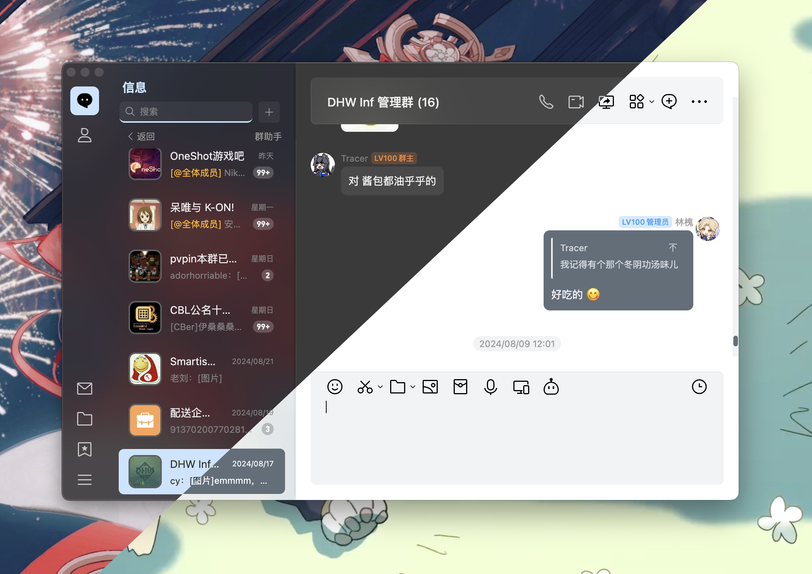

<p align="center">
  <h2 align="center" style="font-weight: 600">Border Card UI Theme</h2>
  <p align="center">
    <strong>一个轻便简洁的 LiteLoaderQQNT 主题</strong>
    <br />
    <br />
    这是一个来自 Stapxs QQ Lite 2.0 第三方客户端样式的迁移版
  </p>
</p>



## 版本支持
- LiteLoaderQQNT >= 1.2.0
- NTQQ Build >= 27254

## 使用方法
### 使用仓库版本
~~~
git clone https://github.com/Stapxs/Stapxs-QQ-Lite-Theme.git
~~~
- 克隆仓库、下载分支 zip 或从仓库 Releases 发布页下载 zip
- 将 zip 解压移动到 ```LiteLoaderQQNT``` plugins 目录下
- 重启 QQ

## 反馈问题
因为我在使用 macOS，所以本主题优先适配 macOS；如果在其他平台遇到了奇怪的布局错误（包括主题色未生效）等问题，欢迎提交 issue！
