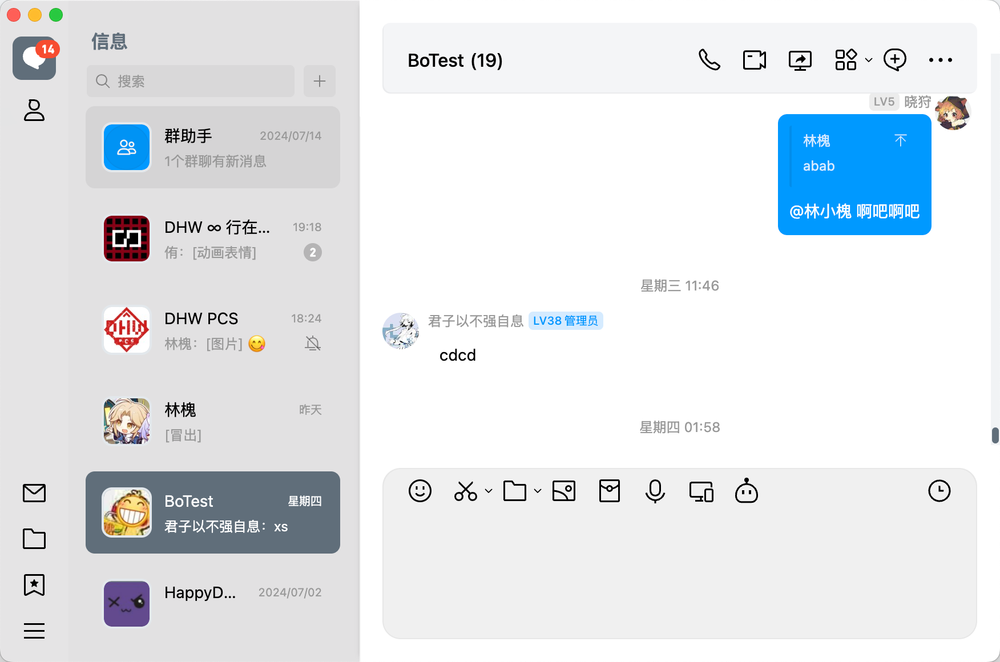

# Stapxs QQ Lite 2.0 Theme

嗨嗨嗨！这是 Stapxs QQ Lite 2.0 Electron 版样式的 LiteLoaderQQNT 迁移版！
如果你不想使用 OneBot 连接 Stapxs QQ Lite 而且打算使用官方 QQ，并且喜欢 Stapxs QQ Lite 的样式的话；这个就是写给你用的！

我会尽量将 Stapxs QQ Lite 的样式通过主题的方式更改到 QQ 官方客户端上，让它看起来更像 Stapxs QQ Lite！

看看 Stapxs QQ Lite？ -> https://github.com/Stapxs/Stapxs-QQ-Lite-2.0



## 使用方法
### 使用仓库版本
~~~
git clone --recursive https://github.com/Stapxs/Stapxs-QQ-Lite-Theme.git
~~~
- 克隆仓库将文件夹或从仓库 Releases 发布页下载 zip。
- 将 zip 移动到 ```LiteLoaderQQNT``` plugins 目录下后重启 QQ

PS：请勿直接下载分支 zip，会缺失子模块内的部分 css 文件。